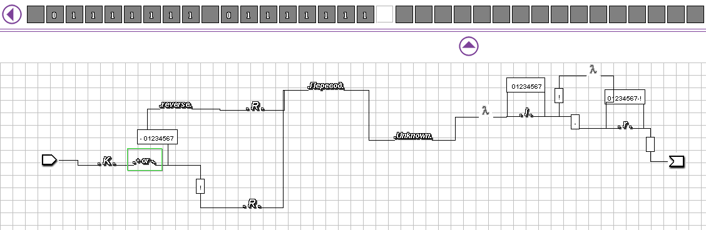
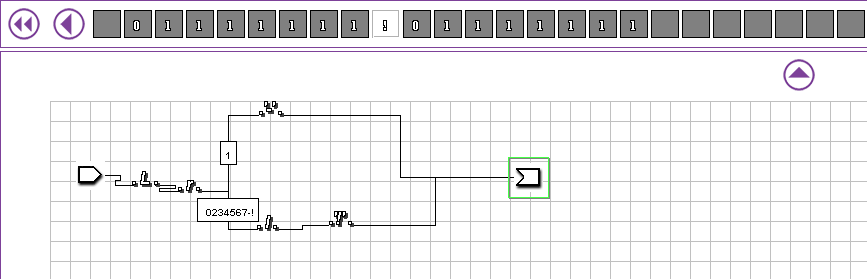
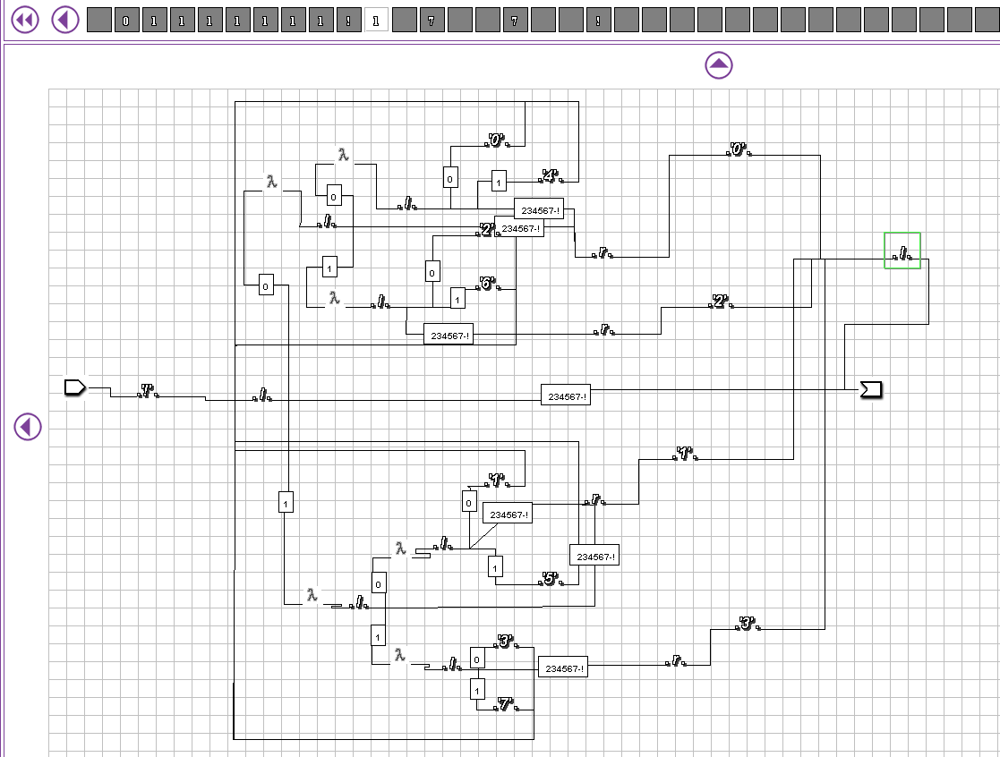
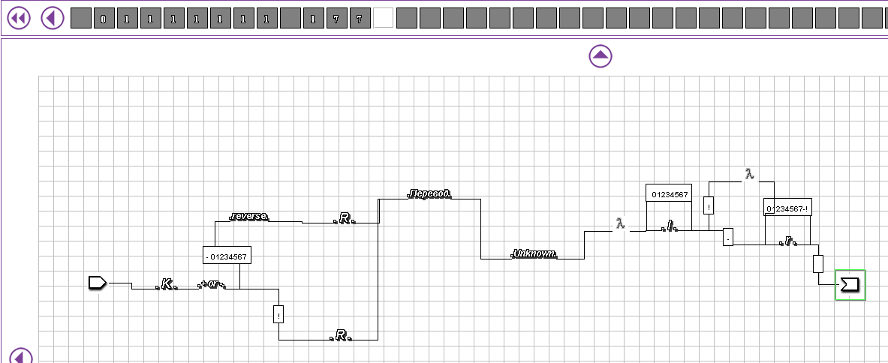

# Отчет по курсовой работе N 2 по курсу
# "Фундаментальная информатика"

Студент группы: M8О-115Б, Моисеев Кирилл Всеволодович\
Контакты: kloshka05@mail.ru \
Работа выполнена: 08.10.2023\
Преподаватель: Чеснов Илья Игоревич

## 1. Тема

Программирование машин Тьюринга при помощи диаграммера

## 2. Цель работы

Составить программу машины Тьюринга используя диаграммер, выполняющую заданное действие над словами, записанными на ленте.

## 3. Задание

В 35. Восстановление целого числа в восьмеричной системе счисления по обратному коду.

## 4. Оборудование

Процессор: Intel Core i3-9100F 3.6GHZ\
ОП: 7851 Мб\
НМД: 1024 Гб\
Монитор: 1920x1080

## 5. Программное обеспечение

Операционная система семейства: **linux (ubuntu)**, версия **20.04.2**\
Интерпретатор команд: **bash**, версия **5.1.16(1)**.\
Система программирования: **--**, версия **--**\
Редактор текстов: **GNU nano**, версия **4.8**\
Утилиты операционной системы: **--**\
Прикладные системы и программы: **--**\
Местонахождение и имена файлов программ и данных на домашнем компьютере: **--**

## 6. Идея, метод, алгоритм решения задачи

Получение прямого кода из обратного. Перевод числа из двоичной системы в восьмеричную будет проводится путем разбиения его на триады, каждая из которых впоследствии будет заменена на соответствующую ей цифру в восьмеричной СС.

## 7. Сценарий выполнения работы

План:
Создадим копию числа, определим по обратному коду его знак, переведем обратный код в прямой, в нем начиная с конца буду выделять по три цифры и переводить их в восьмеричную СС, полученные цифры соберу в число и получу результат перевода
## 8. Распечатка протокола






```
  01111111
  01111111 01111111
  01111111!01111111
  01111111!01111111!
  01111111!1 7  7  !
  01111111!177     !
  01111111 177

```

## 9. Дневник отладки

| № | Лаб. или дом. | Дата       | Время     | Событие                                                | Действие по исправлению   | Примечание     |
|---|---------------|------------|-----------|--------------------------------------------------------|---------------------------|----------------|
|1  | Дом           | 08.10.2023 | 22:13     | Запустил ДТ, он не скомпилировался                     | Исправил конфликт путей   | Частая ошибка  |
|2  | Дом           | 08.10.2023 | 23:03     | Протестировал работу ДТ с обратным кодом 0, она ушла в рекурсию, зависла и не сохранилась | Учёл этот случай в диаграмме |                |

## 10. Замечания автора по существу работы

Крайне занимательная работа...

## 11. Выводы

Это была моя первая встреча с ДТ

